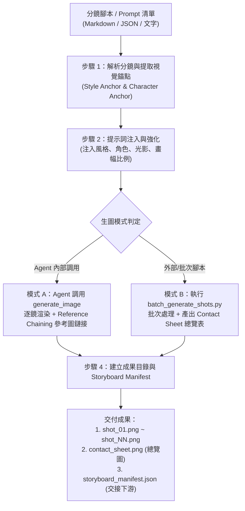

# Storyboard Image Generator (分鏡提示詞繪製與關鍵格批次生成專家)

本 Skill 專職於打通**「分鏡腳本與提示詞（Prompt）」**到**「實體分鏡圖片資產（Image Assets）」**的落地環節。

在短動態影片與動畫生產管線中，本 Skill 位於 `visual-storyboard-artist` / `short-video-director` 之後，`motion-prompt-engineer` 之前。它負責將劇本規劃中的每一個鏡頭 Prompt 實際渲染為標準命名的圖像檔案（`shot_01.png`, `shot_02.png` ...），同時透過「視覺錨點注入（Anchor Injection）」與「參考圖鏈接（Reference Chaining）」技術，嚴格防禦人物面部走樣與畫風崩壞。

---

## 核心職責與執行模式

1. **各分鏡 Prompt 批次實體生圖**：
   - 接收來自分鏡表、JSON 清單或文字腳本的鏡頭 Prompt，批次轉化為對應畫幅比例（`9:16` 直式短影音、`16:9` 橫式電影、`1:1` 方形）的實體圖檔。
2. **跨鏡頭角色與畫風一致性鎖定 (Consistency Anchoring)**：
   - 自動將全域風格詞（Master Style）、角色外貌特徵（Character Anchor）與燈光色彩基調注入每個分鏡。
   - 採用 **Reference Image Chaining** 機制：將角色三視圖（Model Sheet）或前一鏡（Shot N-1）作為參考圖傳入生圖工具，確保臉部輪廓、髮色、衣著跨鏡完全一致。
3. **多模式執行體系 (Multi-Execution Engines)**：
   - **模式 A（Agent 自主生圖）**：Agent 遵循標準 SOP 調用系統內建的 `generate_image` 工具逐鏡產圖。
   - **模式 B（Python 批次腳本）**：利用專屬腳本 [batch_generate_shots.py](./scripts/batch_generate_shots.py) 進行批次排版、預覽占位圖生成、API 呼叫與自動拼合 4/6/9 宮格的故事板聯絡總覽表（Contact Sheet）。
   - **模式 C（RunningHub / MiniMax H3 多參考圖資產包）**：針對 AI 視訊節點工作流，精準解耦並產出「主體角色圖 + 怪物/道具圖 + 環境場景圖 + 起始關鍵格」四合一對齊資產包。
4. **管線成果無縫交接**：
   - 產出標準目錄結構與 `storyboard_manifest.json`，供下游 `motion-prompt-engineer` 直接作為 Image-to-Video（圖生影片）的首幀素材（First Frame Reference）。

---

## 標準執行作業程序 (SOP)



### 步驟 1：解析分鏡與提取視覺錨點
當收到分鏡清單時，先確認專案的兩大錨點：
- **風格主錨點 (Master Style Anchor)**：例如 `Cinematic anime aesthetic, Studio MAPPA line-art, vibrant dynamic colors, sharp focus, 8k render`。
- **角色外貌錨點 (Character Anchor)**：例如 `An athletic 20yo East Asian male basketball player, messy black spiky hair, wearing black #21 basketball jersey with white trims`。
- **畫幅比例 (Aspect Ratio)**：直式短影音一律使用 `9:16`；橫式影片使用 `16:9`。

### 步驟 2：各分鏡 Prompt 強化公式
對每一個分鏡提示詞進行標準化包裝：

$$\text{Final Shot Prompt} = \text{[Master Style]} + \text{[Character Anchor]} + \text{[Shot Action \& Composition]} + \text{[Environment \& Lighting]} + \text{[Quality Boosters]}$$

**範例**：
- *原始分鏡描述*：「主角在空曠球場邊線獨自喘息，眼神堅毅」
- *強化後生圖 Prompt*：
  > `Cinematic anime aesthetic, Studio MAPPA line-art, an athletic 20yo East Asian male basketball player, messy black spiky hair, wearing black #21 basketball jersey, sitting exhausted on empty bench beside hardwood court boundary, chest heaving, glistening sweat beads rolling down cheeks, eyes sharp and burning with fierce determination, volumetric golden hour sunlight streaming through stadium tall windows, rule of thirds composition, 8k resolution, dramatic shadows.`

### 步驟 3：執行生圖 (Agent 內建工具調用標準)
當 Agent 在本環境中執行生圖時，使用 `generate_image` 工具：
* **ImageName**：命名格式 `shot_01_description`（全部小寫底線，例：`shot_01_bench_rest`）。
* **AspectRatio**：短影音指定 `'9:16'`，橫式電影指定 `'16:9'`。
* **ImagePaths (重要：一致性參考圖)**：
  - 第 1 鏡（Shot 01）：若已有角色設計圖（Character Model Sheet），傳入其絕對路徑。
  - 第 2 鏡（Shot 02）以後：傳入角色設計圖及前一鏡（Shot N-1）產生的圖片絕對路徑（最多 3 張），讓生圖引擎維持臉部特徵、球衣細節與光影基調連續。

### 步驟 4：輸出與管線整合清單 (`storyboard_manifest.json`)
完成生圖後，在專案目錄（如 `projects/<project_name>/storyboard_images/`）彙整清單：

```json
{
  "project_name": "buzzer_beater_short",
  "aspect_ratio": "9:16",
  "total_shots": 4,
  "shots": [
    {
      "shot_id": 1,
      "image_file": "shot_01_bench_rest.png",
      "shot_type": "Medium Shot",
      "prompt": "Cinematic anime aesthetic...",
      "keyframe_purpose": "First frame for motion-prompt-engineer"
    },
    {
      "shot_id": 2,
      "image_file": "shot_02_eye_focus.png",
      "shot_type": "Extreme Close-up",
      "prompt": "Cinematic anime aesthetic...",
      "keyframe_purpose": "First frame for motion-prompt-engineer"
    }
  ]
}
```

---

## 模式 C：RunningHub / MiniMax H3 多參考生視頻資產包規範 (Multi-Reference Pack)

當使用者需要在 **RunningHub** 或 **ComfyUI** 運行 **MiniMax H3「參考生視頻」** 節點工作流時，本 Skill 執行以下特化 SOP：

### 1. 四大多參考節點映射表 (Node Mapping)

| RunningHub 節點 | 產出資產命名 | 提示詞設計重點 (Decoupled Prompts) |
| :--- | :--- | :--- |
| **Load Image #1 (主體角色)** | `ref_character.png` | 人物半身或全身，簡潔深色背景，臉部五官、髮型與專屬服飾細節清晰，避免背景干擾。 |
| **Load Image #2 (對象/生物/道具)** | `ref_creature.png` | 怪獸、重裝機甲或關鍵互動對象，強調生物解剖結構、金屬/皮膚質感與特殊光效。 |
| **Load Image #3 (環境場景)** | `ref_environment.png` | 純空景（無人物），確立透視地平線、氣候氛圍（雨夜/風暴）與全域主色調。 |
| **Load Image #4 (起始關鍵格)** | `ref_first_frame.png` | 主角與生物/對象在場景中同框對峙或起始互動之畫面，決定影片第一幀起點。 |

### 2. 雙重產出交付標準
執行模式 C 時，同時交付：
1. **4 張對齊畫幅實體圖檔**（依專案需求設為 `16:9` 或 `9:16`，存於 `references/` 目錄）。
2. **MiniMax H3 專用視訊動態提示詞 (Motion Prompt)**：專注描述主體與生物之間的動作演化與攝影機運鏡，文字框直接填入即可生成高動態影片。

> 詳細工作流指南請參閱：[MiniMax H3 / RunningHub 工作流手冊](./references/minimax-runninghub-workflow-guide.md)。  
> 標準資產設定檔模板：[minimax_h3_reference_template.json](./templates/minimax_h3_reference_template.json)。

---

## 專用 Python 批次處理腳本

本 Skill 隨附高效命令列工具 [batch_generate_shots.py](./scripts/batch_generate_shots.py)：

### 常用命令指令：
1. **生成範例分鏡設定檔模板**：
   ```powershell
   python .agents/skills/storyboard-image-generator/scripts/batch_generate_shots.py --generate-template my_storyboard.json
   ```
2. **預覽排版與產生分鏡聯絡表（Dry-Run 模式，快速檢驗構圖與排版）**：
   ```powershell
   python .agents/skills/storyboard-image-generator/scripts/batch_generate_shots.py -i my_storyboard.json -o ./output_shots/ --dry-run
   ```
3. **自動拼合已產出之分鏡圖為 6 宮格聯絡表 (Contact Sheet)**：
   ```powershell
   python .agents/skills/storyboard-image-generator/scripts/batch_generate_shots.py --make-contact-sheet ./output_shots/ -c 3
   ```

---

## 角色與畫面一致性避坑原則 (Consistency Rules)

1. **錨定詞絕對不可替換**：在同一序列中，角色的年齡、種族、髮型（如 `messy black spiky hair`）、衣著（如 `black #21 jersey`）的英文用詞必須字字一致，切勿在 Shot 1 寫 `black jersey`，Shot 2 寫成 `dark sports shirt`。
2. **景別切換循序漸進**：由全景（Wide Shot）切換至特寫（Close-up）時，特寫鏡頭的 Prompt 務必明確指出鏡頭聚焦於該角色的特定部位（如 `extreme close-up focused on his left eye and cheek`），並維持同方向光源描述。
3. **環境光影方向一致**：若第一鏡光源來自右上方夕陽（`golden hour light from upper right`），後續鏡頭除非發生鏡頭 180 度翻轉（Reverse Angle），否則光影方向與色溫必須保持同調。

詳細一致性控制手冊請參閱：[視覺一致性鎖定指南](./references/consistency-anchoring-guide.md)。
