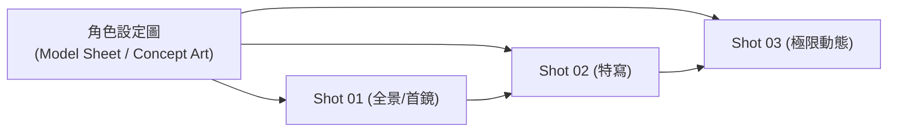

# 視覺一致性鎖定指南 (Visual Consistency Anchoring Guide)

在 AI 影片與分鏡生產流程中，最常見且最具挑戰性的問題就是**「各鏡頭角色面部變形、服裝顏色換款、風格光影跳 tone」**。

本手冊專門為 `storyboard-image-generator` 提供跨鏡頭一致性的提示詞工程守則與參考圖鏈接（Reference Chaining）實戰策略。

---

## 一、 角色特徵錨定 (Character Anchoring)

### 1. 錨定詞絕對字面不變（Word-for-Word Consistency）
在同一系列分鏡中，描述主角外型的關鍵字句必須**百分之百字面鎖定**，不可使用同義詞替換：

* ❌ **錯誤範例（造成人物長相與年齡漂移）**：
  - Shot 01: `a cool East Asian young basketball player with messy hair`
  - Shot 02: `a handsome Asian teen boy in sports jersey`
  - Shot 03: `a student athlete with black hair`
* ✅ **正確範例（高度鎖定特徵）**：
  - 全序列統一：`an athletic 20yo East Asian male basketball player, messy black spiky hair, sharp jawline, intense dark brown eyes, wearing black #21 basketball jersey with white stripes on edges`

### 2. 三大外貌錨定錨點
1. **面部與髮型 (Face & Hair)**：
   - 年齡（`20-year-old`）
   - 種族與膚色（`East Asian, light tan skin`）
   - 髮型特徵（`messy black spiky hair with undercut`）
   - 標誌性面部特徵（`a small scar above left eyebrow, sharp defined jawline`）
2. **專屬服裝代碼 (Costume Anchor)**：
   - 顏色與款式具體化：`black #21 basketball sleeveless jersey with white rib knit trim, black compression shorts`。
   - 避免使用寬泛的 `sportswear` 或 `jersey`，以免 AI 每鏡隨機生成不同號碼或配色。
3. **肢體與身材 (Physique Anchor)**：
   - `lean athletic basketball player build, defined shoulder and deltoid muscles, 185cm tall proportion`。

---

## 二、 參考圖鏈接技術 (Reference Image Chaining)

當使用 Antigravity 內建的 `generate_image` 或外部支援圖像引導的生圖引擎（如 FLUX.1 Redux、Midjourney `--cref`、SD IP-Adapter）時，應採取**多層遞進式參考鏈接（Chaining Protocol）**：



### 傳入 `ImagePaths` 規則（最多 3 張）：
* **Shot 01**：
  - `ImagePaths = [ "path/to/character_model_sheet.png" ]`
* **Shot 02**：
  - `ImagePaths = [ "path/to/character_model_sheet.png", "path/to/shot_01.png" ]`
* **Shot 03**：
  - `ImagePaths = [ "path/to/character_model_sheet.png", "path/to/shot_02.png" ]`

> **原理解析**：
> `character_model_sheet.png` 負責鎖定長相與全身比例；前一鏡（`shot_01.png`）負責鎖定光影色彩調性與特定鏡頭質感。

---

## 三、 光影與色調基調鎖定 (Lighting & Color Consistency)

### 1. 同一場景維持三項光影參數同向
在同一個場景（如室內體育館）的不同鏡頭中，光線來源方向與色溫必須連貫：
* **光源方向**：若 Shot 01 為 `volumetric golden sunlight pouring from large high windows on the left side`，則 Shot 02 除非發生 180 度反打（Reverse Angle），光線仍應保持從畫面左側射入。
* **色調氛圍 (Color Grading)**：在所有鏡頭結尾統一加上調色描述，例如：
  - `Kodak Vision3 500T 35mm film stock, warm amber and teal color grade, high dynamic range`。

---

## 四、 景別切換防崩法則 (Focal Length & Shot Size Transitions)

從全景切換到特寫時，模型常因缺乏上下文而誤生成完全不同的臉：

| 景別轉移 | 常見崩壞點 | 提示詞防禦方案 |
| :--- | :--- | :--- |
| **Wide Shot ➔ Close-up** | 人物臉型完全變了一個人 | 在 Close-up 的 Prompt 中特別強化**局部聚焦引導**：<br>`extreme close-up on the face of the same 20yo East Asian basketball player with spiky black hair, tightly framed from chin to forehead, sweat drops bead on brow, identical facial structure` |
| **Close-up ➔ Wide Action** | 衣服顏色或背號丟失 | 在 Wide Action 的 Prompt 中重新聲明服裝背號：<br>`full-body wide dynamic shot of the athlete wearing the exact same black #21 basketball jersey, diving horizontally` |
| **正面 ➔ 側面 / 俯角** | 髮型或五官比例失真 | 在 Prompt 中聲明解剖學正確性：<br>`side profile silhouette, perfectly proportioned sharp nose bridge and jawline, anatomically correct anatomy` |

---

## 五、 全域負向提示詞標準配置 (Negative Prompt Template)

在所有分鏡任務中，建議預設加入以下負向防禦字串：

```text
blurry, low resolution, out of focus, distorted facial features, mutated eyes, cross-eyed, duplicate face, plastic smooth skin, cartoonish, extra limbs, extra fingers, missing fingers, malformed hands, floating basketball, extra ball, changing jersey color, wrong jersey number, modern logo watermarks, text captions, split screens, borders
```
