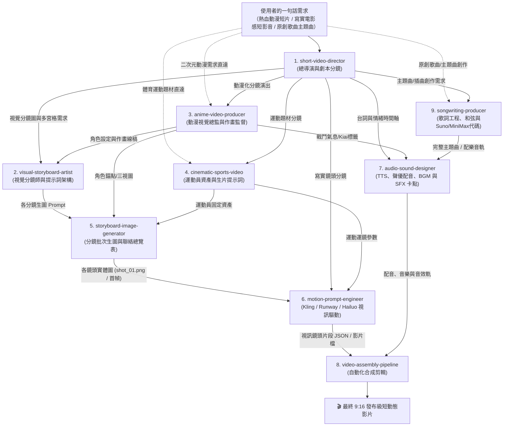

# AI 短動態影片生產管線 Skills 套件 (Short Motion Video Production Suite)

一套專為 **Antigravity / AI Agent** 設計的模組化短動態影片生產技能（Skills Suite）。

本套件專注於為 **TikTok、Instagram Reels、YouTube Shorts** 等主流直式短影音平台打造具備「黃金前 3 秒留存 Hook、電影級 AI 動態運鏡、強節奏音效卡點與自動化剪輯組裝」的高質量短影片。

---

## 目錄結構與模組說明

本專案遵循 Antigravity 官方標準規格，所有 Skills 均存放於 `.agents/skills/` 與 `skills/` 內：

```text
short-video-skills/
├── README.md                                  # 本總覽指南與端到端實戰範例
├── index.html / app.js / style.css            # GitHub Pages 官方展示入口
└── .agents/
    └── skills/
        ├── short-video-director/              # 🎬 模組 1：短影音總導演與劇本架構師
        │   └── SKILL.md                       # 留存心理學、15/30/60秒節奏模板、9:16直式分鏡
        ├── visual-storyboard-artist/          # 🖼️ 模組 2：視覺分鏡師與動態故事板設計專家
        │   ├── SKILL.md                       # 4大分鏡風格、導演鏡頭語法、多宮格(4/6/9格)生圖提示詞
        │   └── references/
        │       └── storyboard-grammar-cheatsheet.md # 焦段透視、三分法則、運鏡箭頭標記、MJ/FLUX模板
        ├── anime-video-producer/              # ⚡ 模組 3：二次元動漫與風格化動畫短片製作專家
        │   ├── SKILL.md                       # 六大動漫學派、角色一致性錨定、日式作畫演出(Sakuga)
        │   ├── references/
        │   │   └── anime-style-dictionary.md  # 日系作畫術語(衝擊影格、板野馬戲團)、名導美學詞典
        │   └── templates/
        │       └── character-model-sheet.md   # 角色一致性三視圖提示詞範本與防崩壞 SOP
        ├── cinematic-sports-video/            # 🏀 模組 4：電影級熱血運動短片專家
        │   └── SKILL.md                       # 運動員資產鎖定(#21)、魚躍救球運鏡、MiniMax H3 標準提示詞
        ├── storyboard-image-generator/        # 🎨 模組 5：分鏡提示詞繪製與關鍵格批次生成專家
        │   ├── SKILL.md                       # SOP、雙模生圖(Agent/腳本)、參考圖鏈接(Chaining)、RunningHub 多參考資產包
        │   ├── scripts/
        │   │   └── batch_generate_shots.py    # 批次生圖、Slate卡片與 Contact Sheet 自動拼合腳本
        │   ├── templates/
        │   │   └── storyboard_shots_template.json # 標準分鏡生圖設定檔模板
        │   └── references/
        │       └── consistency-anchoring-guide.md # 跨鏡頭角色與畫風一致性防崩守則
        ├── motion-prompt-engineer/            # 🎥 模組 6：AI 動態運鏡與提示詞工程師
        │   ├── SKILL.md                       # Runway/Kling/Luma/Hailuo 提示詞語法、API JSON
        │   └── references/
        │       └── camera-movement-lexicon.md # 專業運鏡（推拉搖移、升降、FPV、希區考克變焦）詞典
        ├── audio-sound-designer/              # 🔊 模組 7：聲音設計與節奏卡點專家
        │   └── SKILL.md                       # ElevenLabs TTS 情感標註、Suno BGM 提示詞、SFX 時間軸
        ├── video-assembly-pipeline/           # ✂️ 模組 8：剪輯合成與自動化管線
        │   ├── SKILL.md                       # 9:16 安全區、動態彈跳字幕、FFmpeg 命令
        │   └── scripts/
        │                 └── auto_assemble.py           # 輕量級 Python + FFmpeg 自動組裝腳本
        └── songwriting-producer/              # 🎵 模組 9：歌曲創作與音樂製作專家
            ├── SKILL.md                       # 歌詞工程、雙音韻/內嵌韻、4536251/卡農和弦、Suno/MiniMax 代碼
            ├── references/
            │   └── genre-and-chords-guide.md  # 八大曲風辭典、和弦進程走向、段落情緒能級表
            └── templates/
                └── ai-music-prompt-templates.md # Suno / MiniMax Music 3 / Udio 開箱即用模版與防死音指南
```

---

## 9 大技能管線協同流程 (Pipeline Workflow)



---

## 實戰全流程示範：15 秒熱血動態短片《極限突破》

以下示範當使用者要求：「**製作一段 15 秒極致熱血、主角在最後一秒絕殺逆轉的動態短片**」時，技能如何全自動聯動：

### 階段一：`short-video-director` 輸出分鏡與 Hook

* **時長與風格**：15 秒極限視覺爽片，動漫寫實風（Cinematic Anime），9:16 直式。
* **黃金 3 秒 Hook**：【視覺衝擊型】絕境比分落後 1 分，倒數 3 秒，主角雙眼燃燒金光，大汗淋漓。
* **分鏡表**：

| 鏡頭編號 | 時間範圍 | 景別與運鏡 | 畫面視覺動態 | 旁白/台詞配音 | 字幕與音效 |
| :--- | :--- | :--- | :--- | :--- | :--- |
| **Shot 01** | 00:00 - 00:03 | 特寫 / 快速推鏡 (Crash Zoom) | 汗水沿著下巴甩出，計分板紅光頻閃，主角咬牙直視前方 | 「所有人都叫我放棄……」 | [字卡：絕境倒數] + [SFX: 沉悶心跳聲 + 警報重低音] |
| **Shot 02** | 00:03 - 00:07 | 中景 / 低角度極速跟鏡 (Tracking) | 主角重心壓低極限切入，防守球員失衡倒地，地面擦出火星殘影 | 「但抱歉……」 | [字卡：撕碎它！] + [SFX: 球鞋刺耳摩擦聲 + 風刃呼嘯] |
| **Shot 03** | 00:07 - 00:11 | 仰角 / 360° 環繞慢動作 (Arc Shot) | 高高躍起滯空，燈光形成環形光暈，指尖壓腕出手 | 「這座球場，我說了算！」 | [字卡：起跳封神] + [SFX: 高頻心跳驟停，全場屏息微寂靜] |
| **Shot 04** | 00:11 - 00:15 | 俯衝 / 快速甩鏡 (Whip Pan) | 籃球空心入網，紅燈在籃板後炸裂，隊友狂奔衝撞慶祝 | *(吼聲喘息)* | [字卡：絕殺！] + [SFX: 清脆擦網破空聲 + 808 重砲打擊轟鳴] |

---

### 階段二：`storyboard-image-generator` 批次產出實體分鏡圖與聯絡總覽表

將分鏡表中各鏡頭 Prompt 注入風格與人物錨點，批次產出實體圖片：
* **視覺錨點注入**：`Master Style Anchor`（動漫寫實）+ `Character Anchor`（黑髮刺蝟頭 #21 號球員）。
* **Reference Chaining**：第 2 鏡開始自動參考前鏡圖片（`ImagePaths`），維持面部輪廓與球衣顏色跨鏡不變形。
* **交付資產**：產出 `shot_01.png` ~ `shot_04.png` 與 4 宮格故事板聯絡表 `contact_sheet.png`。

```powershell
# 執行批次處理腳本自動排版或預覽聯絡表：
python .agents/skills/storyboard-image-generator/scripts/batch_generate_shots.py -i storyboard.json -o ./output_shots/ --dry-run
```

---

### 階段三：`motion-prompt-engineer` 輸出生片提示詞與 API JSON

自動將 `storyboard-image-generator` 產出之首幀圖片（`first_frame_reference`）與運鏡指令封裝為 Runway Gen-3 / Kling 1.5 規範的 JSON：

```json
[
  {
    "shot_id": 1,
    "duration_sec": 3.0,
    "aspect_ratio": "9:16",
    "first_frame_reference": "shot_01.png",
    "camera_movement": "Violent crash zoom into eyes",
    "motion_strength": 8,
    "prompt": "Cinematic 9:16 vertical, intense close-up of a 20yo East Asian basketball athlete with messy black hair, sweating heavily, violent crash zoom into his dilated pupil reflecting scoreboard red light, high contrast rim lighting, hyper-realistic anime cinematic style, 8k resolution.",
    "negative_prompt": "static, smiling, blurry, deformed limbs, smooth plastic skin"
  },
  {
    "shot_id": 2,
    "duration_sec": 4.0,
    "aspect_ratio": "9:16",
    "first_frame_reference": "shot_02.png",
    "camera_movement": "Dynamic low-angle lateral tracking",
    "motion_strength": 9,
    "prompt": "Cinematic 9:16 vertical, dynamic low-angle tracking shot following athlete dribbling with explosive crossover, defender falling back on hardwood floor, floor light reflections, speed ramping from slow-motion to hyper-speed burst, sweat droplets flying backward.",
    "negative_prompt": "floating, multiple balls, disjointed legs, low frame rate"
  }
]
```

---

### 階段四：`audio-sound-designer` 輸出配音、BGM 與 SFX 對位

* **TTS 語音標註腳本 (ElevenLabs 專用)**：
  > `[whisper] 所有人都叫我放棄…… [pause 0.4s] [intense/gasp] 但抱歉！ [pause 0.2s] [emphasis] 這座球場，[emphasis] 我說了算！`
* **Suno 配樂提示詞**：
  > `Genre: Epic hybrid orchestral trap, 135 BPM, aggressive brass stabs, ticking trap hi-hats, heavy sub 808, sudden silence drop at 7s, explosive choir impact at 11s, high school sports anime hype.`
* **SFX 精密卡點時間軸**：
  - `00:00.00`：`Deep Sub Boom + Electronic Glitch`（震撼開場）
  - `00:03.00`：`Sneaker Hard Squeak + Air Whoosh`（交叉步切入變向）
  - `00:07.00`：`Heartbeat Muffle + High-pass Filter Drop`（進入起跳微寂靜空間）
  - `00:11.20`：`Crisp Net Swish + Sub-bass 808 Slam + Crowd Roar`（進球絕殺轟鳴）

---

### 階段五：`video-assembly-pipeline` 組裝合成

只需準備好素材並建立 `manifest.json`：
```json
{
  "project_name": "buzzer_beater_15s",
  "resolution": {"width": 1080, "height": 1920},
  "fps": 30,
  "shots": [
    {"file": "shot_01.mp4", "duration_sec": 3.0},
    {"file": "shot_02.mp4", "duration_sec": 4.0},
    {"file": "shot_03.mp4", "duration_sec": 4.0},
    {"file": "shot_04.mp4", "duration_sec": 4.0}
  ],
  "audio": {
    "voiceover": {"file": "voiceover.mp3", "volume": 1.0},
    "bgm": {"file": "bgm.mp3", "volume": 0.22, "fade_out_sec": 1.0}
  },
  "subtitles": {
    "file": "subtitles.srt",
    "font_size": 18,
    "margin_v": 180
  }
}
```

執行自動組裝命令：
```bash
python .agents/skills/video-assembly-pipeline/scripts/auto_assemble.py -m manifest.json -o final_short.mp4
```

---

## 如何在 Antigravity 中使用此 Skills 套件

1. **直接將本專案設定為工作區**：
   將 Antigravity 的 Workspace 開啟於此目錄（`C:\Users\mice\.gemini\antigravity-ide\scratch\short-video-skills`），系統會自動偵測並註冊 `.agents/skills/` 內的所有技能。
2. **自然語言喚醒**：
   只要在對話中提及短動態影片的需求，例如：
   - *「我想拍一支 30 秒的科幻懸疑短影音，幫我規劃分鏡」* ➔ 自動觸發 `short-video-director`。
   - *「把這份分鏡轉成視覺分鏡表與多宮格構圖提示詞」* ➔ 自動觸發 `visual-storyboard-artist`。
   - *「以日系熱血動畫 MAPPA 風格製作戰鬥動畫與三視圖」* ➔ 自動觸發 `anime-video-producer`。
   - *「製作熱血籃球員奮鬥短片、救球運鏡與 MiniMax H3 專用提示詞」* ➔ 自動觸發 `cinematic-sports-video`。
   - *「把這些分鏡 Prompt 批次生成圖片與聯絡總覽表」* ➔ 自動觸發 `storyboard-image-generator`。
   - *「幫我產出 RunningHub / MiniMax H3 參考生視頻所需的主角、怪物與場景參考圖」* ➔ 自動觸發 `storyboard-image-generator` (模式 C)。
   - *「把這份分鏡轉成 Runway Gen-3 的運鏡提示詞與 JSON」* ➔ 自動觸發 `motion-prompt-engineer`。
   - *「幫我設計這段旁白的 TTS 情感停頓與 BGM/SFX 卡點表」* ➔ 自動觸發 `audio-sound-designer`。
   - *「創作一首華語流行抒情主題曲的歌詞、和弦與 Suno/MiniMax 提示詞」* ➔ 自動觸發 `songwriting-producer`。
   - *「把鏡頭和聲音合成直式 9:16 短片」* ➔ 自動觸發 `video-assembly-pipeline`。
