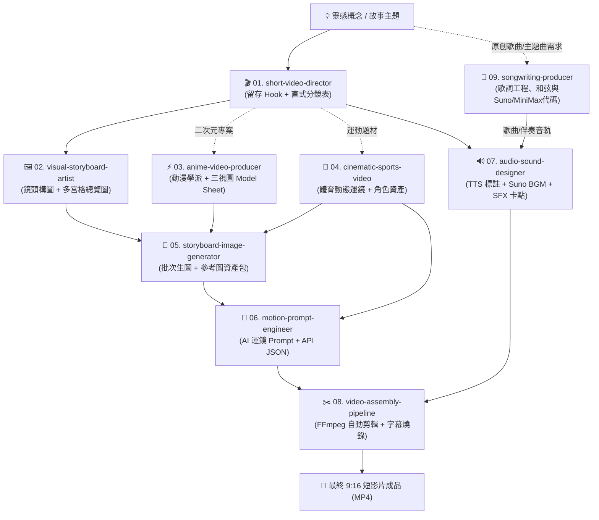

# AI 短動態影片技能套件目錄 (Skills Catalog)

歡迎使用 **AI Short Video Skills Suite (AI 短動態影片工業級技能庫)**。  
本目錄彙整了短影音（TikTok / Instagram Reels / YouTube Shorts）從「創意企劃、導演分鏡、二次元與寫實美術設定、批次生圖與資產鎖定、視訊運鏡提示詞工程、聲音設計與節奏卡點、原創歌曲創作與音樂製作」到「FFmpeg 自動化剪輯合成」的全鏈路 9 大專業 Agent 技能。

---

## 📁 技能模組完整樹狀目錄 (Skills Directory Tree)

```text
skills/
├── README.md                          # [本文件] 技能總目錄與導覽指南
├── short-video-director/              # 🎬 01. 短動態影片總導演與劇本架構師
│   └── SKILL.md                       #     黃金 3 秒留存 Hook、15/30/60s 節奏曲線與 9:16 分鏡
├── visual-storyboard-artist/          # 🖼️ 02. 視覺分鏡師與故事板設計專家
│   ├── SKILL.md                       #     4 大分鏡風格、構圖法、多宮格提示詞
│   └── references/
│       └── storyboard-grammar-cheatsheet.md  # 鏡頭焦段、透視感與運鏡箭頭標記規範
├── anime-video-producer/              # ⚡ 03. 二次元動漫與風格化動畫製作專家
│   ├── SKILL.md                       #     6 大動漫學派、角色一致性錨定、Sakuga 作畫演出
│   ├── references/
│   │   └── anime-style-dictionary.md  # 衝擊影格 (Impact Frames)、工作室風格辭典
│   └── templates/
│       └── character-model-sheet.md   # 角色三視圖與表情矩陣提示詞範本
├── cinematic-sports-video/            # 🏀 04. 電影級熱血運動短片專家
│   └── SKILL.md                       #     高張力運動運鏡、角色資產庫、MiniMax H3 標準提示詞
├── storyboard-image-generator/        # 🎨 05. 分鏡提示詞繪製與關鍵格批次生成專家
│   ├── SKILL.md                       #     提示詞注入、Reference Chaining、RunningHub 多參考資產包
│   ├── references/
│   │   └── consistency-anchoring-guide.md    # 跨鏡頭角色與光影防崩壞手冊
│   ├── resources/
│   │   └── character_assets.json      # 實體角色資產映射
│   ├── scripts/
│   │   └── batch_generate_shots.py    # Python 批次產圖、預覽圖卡與聯絡表 (Contact Sheet) 工具
│   └── templates/
│       └── storyboard_shots_template.json    # 分鏡批次生圖設定檔模板
├── motion-prompt-engineer/            # 🎥 06. AI 動態運鏡與提示詞工程師
│   ├── SKILL.md                       #     5 層遞進語法公式、Kling / Runway / Hailuo 參數、API JSON
│   └── references/
│       └── camera-movement-lexicon.md # 攝影機運動軌跡、物理動力學與環境干涉詞典
├── audio-sound-designer/              # 🔊 07. 聲音設計與節奏卡點專家
│   └── SKILL.md                       #     TTS 語音情緒標記、Suno 130 BPM 提示詞、毫秒級 SFX Cue Sheet
├── video-assembly-pipeline/           # ✂️ 08. 剪輯合成與自動化管線專家
│   ├── SKILL.md                       #     9:16 直式安全區、爆款彈跳字幕、FFmpeg 混音組裝
│   └── scripts/
│       └── auto_assemble.py           # 一鍵自動讀取 manifest.json 合成最終成品影片腳本
└── songwriting-producer/              # 🎵 09. 歌曲創作與音樂製作專家
    ├── SKILL.md                       #     歌詞工程、押韻規劃、4536251/卡農和弦、Suno/MiniMax 提示詞
    ├── references/
    │   └── genre-and-chords-guide.md  # 八大曲風辭典、經典和弦走向、段落情緒能級表
    └── templates/
        └── ai-music-prompt-templates.md # Suno / MiniMax Music 3 / Udio 開箱即用模版與防死音指南
```

---

## 🚀 9 大技能庫核心職責與定位對照表

| 順序 | 技能名稱 (Skill Name) | 核心定位與產出物 | 推薦調用時機 |
| :---: | :--- | :--- | :--- |
| **01** | **`short-video-director`** | **短片總導演**<br>• 黃金前 3 秒留存 Hook 設計<br>• 15s / 30s / 60s 節奏結構模板<br>• 9:16 直式分鏡時間軸 Markdown 表格 | 想要企劃一部新短片、發想劇情或設計高留存率開場時。 |
| **02** | **`visual-storyboard-artist`** | **視覺分鏡師**<br>• 4 大分鏡風格（好萊塢草圖 / 日漫 E-Konte / 3D 灰模 / 電影彩色關鍵格）<br>• 4/6/9 宮格 Contact Sheet 生圖 Prompt | 需要繪製故事板、確定鏡頭景別與構圖語法時。 |
| **03** | **`anime-video-producer`** | **動漫動畫專家**<br>• 6 大日漫美術學派（熱血 Sakuga / 新海誠光影 / 吉卜力手繪 / 奧術 2.5D 等）<br>• 角色 DNA 錨點與三視圖 Model Sheet<br>• 衝擊影格 (Impact Frames) 與作畫演出 | 創作日系動漫、熱血戰鬥、二次元風格化動畫短片時。 |
| **04** | **`cinematic-sports-video`** | **熱血運動專家**<br>• 運動員角色資產鎖定（球衣 #21、肌肉汗水質感）<br>• 120fps 慢動作與魚躍救球運鏡語彙<br>• RunningHub & MiniMax H3 專用 7 鏡頭提示詞 | 製作籃球、足球、田徑、格鬥等高動態體育題材短片時。 |
| **05** | **`storyboard-image-generator`** | **批次生圖與資產包**<br>• 提示詞全域風格與角色錨點注入<br>• Reference Chaining 參考圖鏈接技術<br>• MiniMax H3 / RunningHub 四大多參考圖資產包<br>• `batch_generate_shots.py` 批次排版與總覽圖生成 | 將文字分鏡 Prompt 批次渲染為實體圖檔，或準備視訊首影格素材時。 |
| **06** | **`motion-prompt-engineer`** | **運鏡提示詞工程師**<br>• 5 層遞進語法公式（主體動作+運鏡軌跡+物理流體+光影氛圍+規格標籤）<br>• Kling / Runway Gen-3 / Hailuo / Sora 參數調校<br>• 生產級 API JSON 陣列輸出 | 將分鏡轉換為 AI 視訊模型的專用英文 Prompt 與運鏡控制代碼時。 |
| **07** | **`audio-sound-designer`** | **聲音設計師**<br>• TTS 語音合成情緒標籤（`[whisper]`, `[gasp]`, `[pause]`）<br>• 120~140 BPM Suno / Udio 背景音樂提示詞<br>• 毫秒級 SFX 擬音卡點時間軸與人聲 Ducking 閃避規劃 | 設計配音台詞、配樂風格、重音打擊點與音效時間軸時。 |
| **08** | **`video-assembly-pipeline`** | **合成剪輯工程師**<br>• 9:16 直式安全區防遮擋排版<br>• 高對比彈跳動態字幕規格<br>• `auto_assemble.py` FFmpeg 影片+音軌+字幕一鍵混音合成 | 鏡頭與音訊已產出，需要自動組裝出最終 MP4 成品影片時。 |
| **09** | **`songwriting-producer`** | **歌曲創作與音樂製作人**<br>• 完整歌詞工程（雙音韻、內嵌韻、視聽通感）<br>• 4536251 / 卡農 / 小室 / R&B 和弦進程配置<br>• Suno v3.5/v4、Udio、MiniMax Music 3 專用代碼<br>• 杜絕 MiniMax 靜音死音與 Suno 複讀防坑技術 | 需要原創歌詞、主題曲製作、自彈自唱和弦或 AI 歌曲生成時。 |

---

## 🔄 全自動短影片生產管線協同流程 (Pipeline Flow)

各 Agent 技能無縫串接，實現從「一句靈感概念」到「9:16 成品發布」的工業化流程：



---

## 🛠️ 專用工具腳本使用指南

### 1. 分鏡批次生圖與聯絡表工具 (`storyboard-image-generator/scripts/batch_generate_shots.py`)

* **生成分鏡範本設定檔**：
  ```bash
  python skills/storyboard-image-generator/scripts/batch_generate_shots.py --generate-template my_storyboard.json
  ```
* **執行預覽模式 (Dry-run)，生成分鏡規格圖卡與總覽表**：
  ```bash
  python skills/storyboard-image-generator/scripts/batch_generate_shots.py -i my_storyboard.json -o ./output_shots/ --dry-run
  ```
* **將已有圖片自動拼合為 6 宮格聯絡表 (Contact Sheet)**：
  ```bash
  python skills/storyboard-image-generator/scripts/batch_generate_shots.py --make-contact-sheet ./output_shots/ -c 3
  ```

### 2. 視訊一鍵自動組裝工具 (`video-assembly-pipeline/scripts/auto_assemble.py`)

* **生成組裝清單範本 `manifest.json`**：
  ```bash
  python skills/video-assembly-pipeline/scripts/auto_assemble.py --generate-sample-manifest
  ```
* **一鍵執行 FFmpeg 無損拼接、BGM 閃避混音與字幕燒錄**：
  ```bash
  python skills/video-assembly-pipeline/scripts/auto_assemble.py -m manifest.json -o final_master.mp4
  ```
* **預覽 FFmpeg 組裝指令（不實際執行）**：
  ```bash
  python skills/video-assembly-pipeline/scripts/auto_assemble.py -m manifest.json -o final_master.mp4 --dry-run
  ```

---

## 🎯 如何在對話中呼叫任一 Skill？

當你在 Antigravity IDE 中進行短動態影片創作時，可直接要求 Agent 載入對應技能，例如：
* *「請使用 `short-video-director` 幫我寫一支 15 秒賽博龐克跑酷的短片劇本」*
* *「請使用 `visual-storyboard-artist` 繪製 6 宮格分鏡聯絡圖與鏡頭構圖標記」*
* *「請載入 `anime-video-producer`，以 MAPPA 熱血風格為這段分鏡設計衝擊影格與三視圖」*
* *「請調用 `cinematic-sports-video` 設計 120fps 平飛救球分鏡與 MiniMax H3 專用提示詞」*
* *「請調用 `storyboard-image-generator` 模式 C，產出 MiniMax H3 參考生視頻資產包」*
* *「請使用 `motion-prompt-engineer` 將上述分鏡轉為 Kling 1.5 專用運鏡提示詞與 API JSON」*
* *「請使用 `audio-sound-designer` 設計 130 BPM Suno 配樂提示詞與 SFX 卡點對位表」*
* *「請使用 `songwriting-producer` 為短片創作一首 4536251 經典和弦與 Suno/MiniMax 提示詞的專屬主題曲」*
* *「請使用 `video-assembly-pipeline` 輸出 FFmpeg 組裝命令」*
